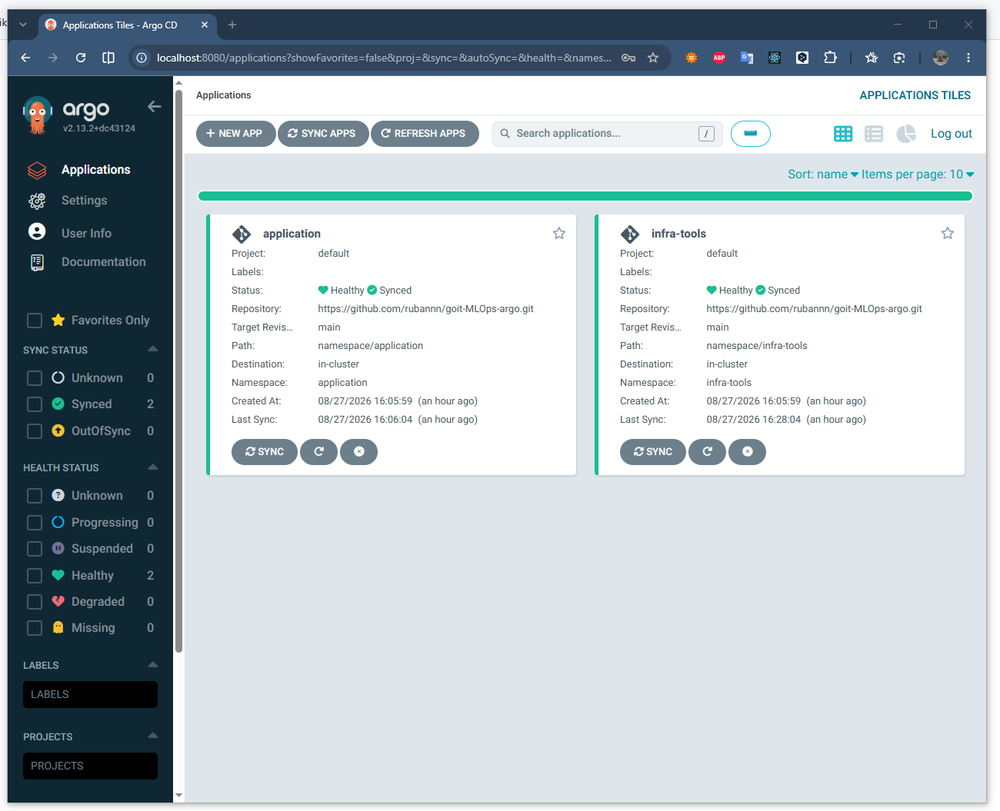
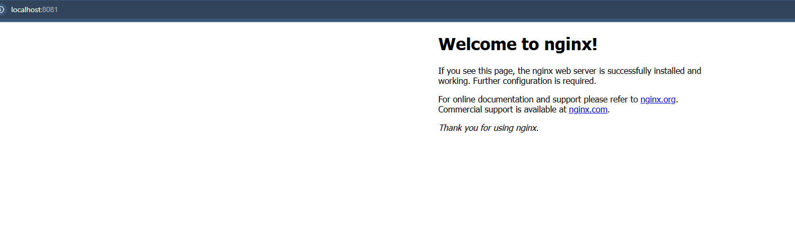

# goit-MLOps

Argo CD розгорнуто в EKS-кластері як `helm_release` через Terraform ([terraform/argocd/](terraform/argocd/)), у namespace `infra-tools`, усі значення чарту винесені в [values/argocd-values.yaml](terraform/argocd/values/argocd-values.yaml). Argo CD відстежує GitOps-репозиторій [goit-MLOps-argo](https://github.com/rubannn/goit-MLOps-argo) через `ApplicationSet`, структура якого — `namespace/*`.

## Вимоги

- Terraform >= 1.5
- AWS CLI з налаштованим профілем (`aws configure --profile goit-terraform`)
- kubectl
- Уже розгорнуті VPC та EKS (`eks-vpc-cluster/vpc`, `eks-vpc-cluster/eks`)

## Запуск

```bash
cd terraform/argocd
terraform init
terraform apply
```

## Перевірка

Argo CD запущено:

```bash
kubectl get pods -n infra-tools
```

Мають бути кілька pod-ів з префіксом `argocd-` у статусі `Running`.

ApplicationSet підхопив GitOps-репозиторій:

```bash
kubectl get applicationset -n infra-tools
kubectl get applications -n infra-tools
```

Очікується `ApplicationSet` `gitops-namespaces` і два `Application` (`application`, `infra-tools`) зі статусом `Synced` / `Healthy`.

Демозастосунок розгорнувся:

```bash
kubectl get deploy -n application
kubectl get pods -n application
```

## Argo CD UI

```bash
kubectl -n infra-tools port-forward svc/argocd-server 8080:80
```

Сервер запущено за адресою `http://localhost:8080`

```bash
kubectl -n infra-tools get secret argocd-initial-admin-secret -o jsonpath="{.data.password}" | base64 -d
```



## Доступ до демозастосунку

```bash
kubectl -n application port-forward deployment/demo-nginx 8081:80
```

Відкрити `http://localhost:8081` — має відобразитись сторінка "Welcome to nginx!".



## Скріншоти

Скріншоти виконання команд (`terraform init`/`apply`, перевірка `kubectl`, доступ до nginx у браузері) — у директорії [`img/`](img/).
