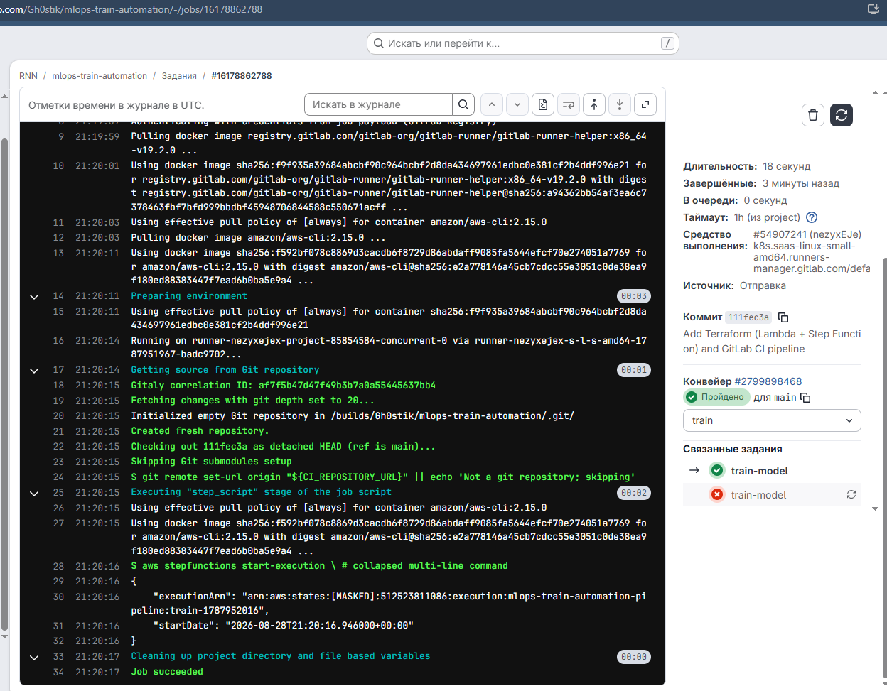

# goit-MLOps

Argo CD розгорнуто в EKS-кластері як `helm_release` через Terraform ([terraform/argocd/](terraform/argocd/)), у namespace `infra-tools`, усі значення чарту винесені в [values/argocd-values.yaml](terraform/argocd/values/argocd-values.yaml). Argo CD відстежує GitOps-репозиторій [goit-MLOps-argo](https://github.com/rubannn/goit-MLOps-argo) через `ApplicationSet`, структура якого — `namespace/*`.

## Вимоги

- Terraform >= 1.5
- AWS CLI з налаштованим профілем (`aws configure --profile goit-terraform`)
- kubectl
- Уже розгорнуті VPC та EKS (`eks-vpc-cluster/vpc`, `eks-vpc-cluster/eks`)

## Запуск

```bash
cd terraform/argocd
terraform init
terraform apply
```

## Перевірка

Argo CD запущено:

```bash
kubectl get pods -n infra-tools
```

Мають бути кілька pod-ів з префіксом `argocd-` у статусі `Running`.

ApplicationSet підхопив GitOps-репозиторій:

```bash
kubectl get applicationset -n infra-tools
kubectl get applications -n infra-tools
```

Очікується `ApplicationSet` `gitops-namespaces` і два `Application` (`application`, `infra-tools`) зі статусом `Synced` / `Healthy`.

Демозастосунок розгорнувся:

```bash
kubectl get deploy -n application
kubectl get pods -n application
```

## Argo CD UI

```bash
kubectl -n infra-tools port-forward svc/argocd-server 8080:80
```

Сервер запущено за адресою `http://localhost:8080`

```bash
kubectl -n infra-tools get secret argocd-initial-admin-secret -o jsonpath="{.data.password}" | base64 -d
```


## Доступ до демозастосунку

```bash
kubectl -n application port-forward deployment/demo-nginx 8081:80
```

Відкрити `http://localhost:8081` — має відобразитись сторінка "Welcome to nginx!".


## Скріншоти

Скріншоти виконання команд (`terraform init`/`apply`, перевірка `kubectl`, доступ до nginx у браузері) — у директорії [`img/`](img/).

## ДЗ 4: Трекінг ML-експериментів (MLflow + PushGateway + Grafana)

MLflow, MinIO, PostgreSQL, Prometheus PushGateway та `kube-prometheus-stack` (Prometheus + Grafana) розгорнуті через ArgoCD як окремі `Application` (app-of-apps, [goit-MLOps-argo/argocd/applications/](https://github.com/rubannn/goit-MLOps-argo/tree/main/argocd/applications)). Скрипт [experiments/train_and_push.py](experiments/train_and_push.py) тренує кілька моделей `LogisticRegression` на датасеті Iris із різними параметрами, логує їх у MLflow і пушить метрики `mlflow_accuracy`/`mlflow_loss` у PushGateway.

### Запуск `train_and_push.py`

```bash
cd experiments
pip install -r requirements.txt
```

Скопіювати `.env.example` в `.env` (значення вже підходять для типового `port-forward`, наведеного нижче):

```bash
cp .env.example .env
python train_and_push.py
```

Після завершення найкраща модель зберігається в `experiments/best_model/`.

### Перевірка наявності MLflow і PushGateway у кластері

```bash
kubectl get applications -n infra-tools
kubectl get pods -n mlflow
kubectl get pods -n monitoring
```

Мають бути `Application`-и `minio`, `postgres`, `mlflow`, `pushgateway`, `monitoring-stack` зі статусом `Synced`/`Healthy`, і відповідні pod-и в статусі `Running`.

### Port-forward

Для запуску `train_and_push.py` потрібні одразу 3 проброшених порти (в окремих терміналах):

```bash
kubectl -n mlflow port-forward svc/mlflow 5000:5000
kubectl -n monitoring port-forward svc/pushgateway-prometheus-pushgateway 9091:9091
kubectl -n mlflow port-forward svc/minio 9000:9000
```

`http://localhost:5000` — MLflow UI, `http://localhost:9091` — PushGateway.

### Перегляд метрик у Grafana

```bash
kubectl -n monitoring port-forward svc/monitoring-stack-grafana 3001:80
kubectl get secret monitoring-stack-grafana -n monitoring -o jsonpath='{.data.admin-password}' | base64 -d
```

Відкрити `http://localhost:3001`, логін `admin` і пароль з команди вище. Ліворуч **Explore** → datasource **Prometheus** → запит `mlflow_accuracy` або `mlflow_loss`.

### Скріншоти

| # | Що зображено |
|---|---|
| [11](img/11.png) | MLflow UI — головна сторінка |
| [12](img/12.png) | PushGateway — сторінка Status |
| [13](img/13.png), [14](img/14.png) | MLflow — деталі окремих runs |
| [15](img/15.png) | Термінал: повний вивід `train_and_push.py` (8 runs, найкраща модель знайдена) |
| [16](img/16.png) | PushGateway — сторінка Metrics (`mlflow_accuracy`/`mlflow_loss` по всіх runs) |
| [17](img/17.png) | Grafana → Explore → Prometheus — `mlflow_accuracy` |
| [18](img/18.png) | Grafana → Explore → Prometheus — `mlflow_loss` |

## ДЗ 5: Автоматизація тренування (AWS Step Functions + GitLab CI)

Код розроблявся і застосовувався в окремому GitLab-репозиторії [mlops-train-automation](https://gitlab.com/Gh0stik/mlops-train-automation) (потрібно, бо `.gitlab-ci.yml` виконується лише на реальному GitLab-проєкті). Тут, у [mlops-train-automation/](mlops-train-automation/), — дзеркальна копія того ж коду для єдиного формату здачі.

Дві Lambda-функції (`validate.py`, `log_metrics.py`) розгорнуті через Terraform разом зі Step Function `ValidateData → LogMetrics`. GitLab CI job `train-model` запускає Step Function через `aws stepfunctions start-execution` після кожного `push`.

Повні інструкції (створення Lambda-архівів, `terraform apply`, ручний запуск Step Function, змінні CI/CD, приклад JSON) — у [mlops-train-automation/README.md](mlops-train-automation/README.md).


